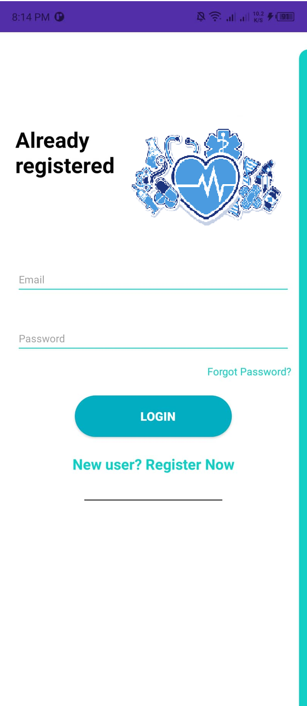
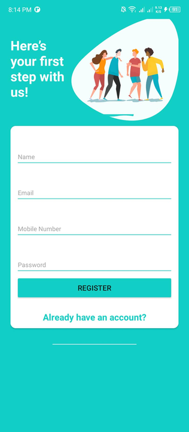
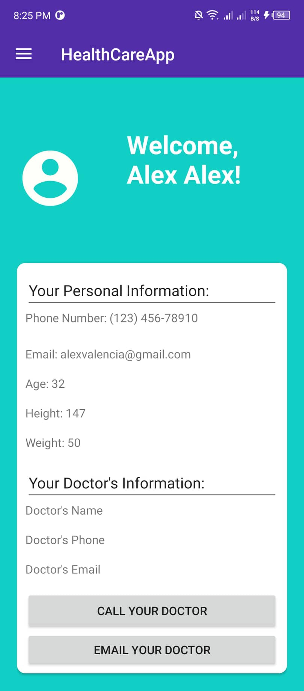
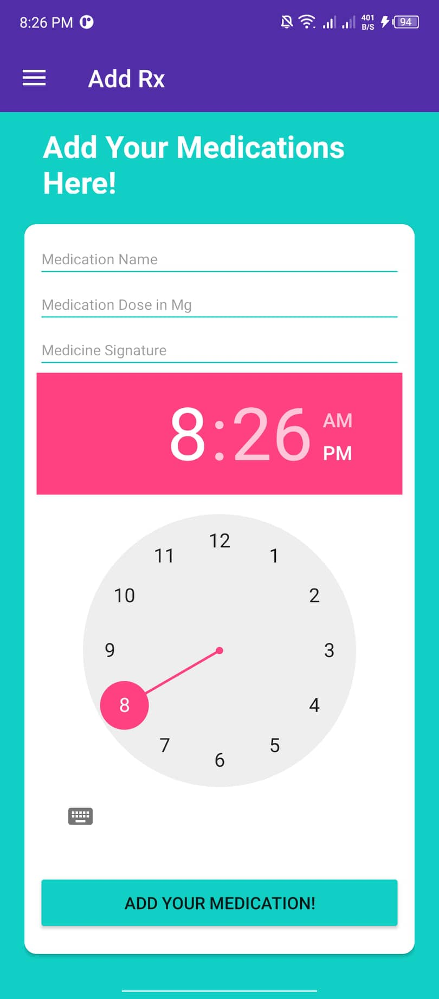
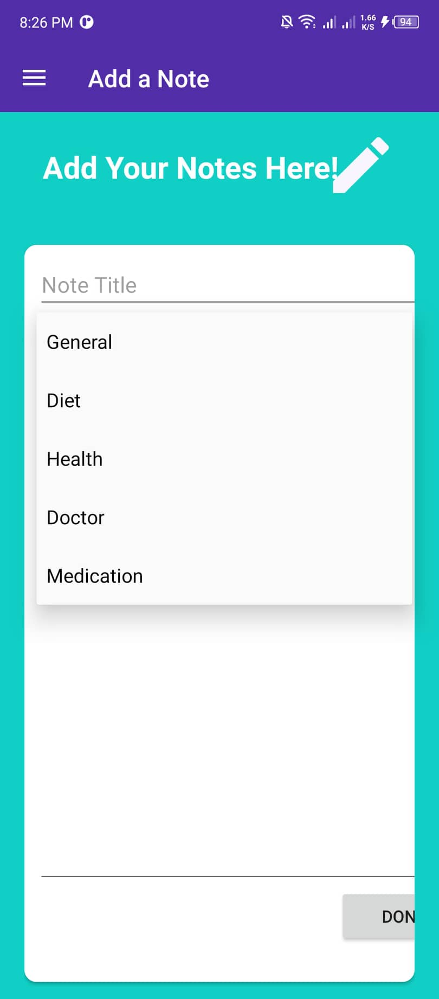
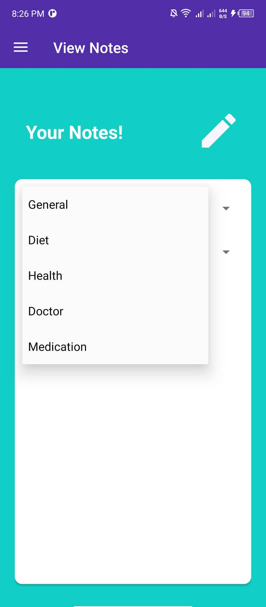

# HealthCare-Reminder
 
</img>
 

This application is an application in which an automatic reminder or alarming system is built. This application mainly focuses on helping patients by organizing interaction with the Doctors. The patients are to be reminded to take medications, and this app assists in setting reminders, to alert, and tell them to take their medicine dosage and also the food that they take at the precise time.

# Adviser
- Jefferson A. Costales

# Developer
- Alex Valencia
- Siemon Castillo
- John Carlo Desuyo
- Mikko Mandin

# Institute
Eulogio "Amang" Rodriguez Insitute of Science and Technology Nagtahan, Sampaloc, Manila, Philippines College of Arts and Sciences

# Course and Subject
Bachelor of Science in Information Technology
Mobile Application Development 1

# Demo Video
https://youtu.be/0mjs6UgChh0

# Application Overview

Log In/Register Page
 
</img>  

</img>  

Call and Email Page

</img>  

Alarm/Reminder Page

</img> 

 
Notes Page 

</img>

</img> 

